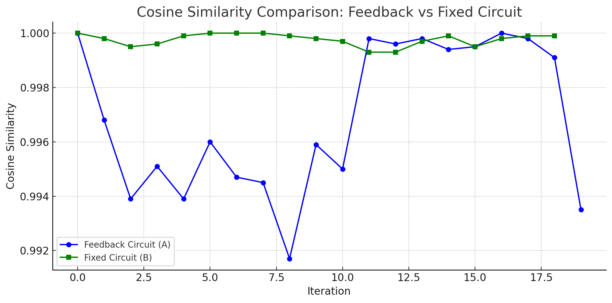

# Quantum Intent Feedback: Structural Mutation and Self-Amplification in Quantum Circuits

**양자 의도 피드백: 양자 회로의 구조 변형과 자기 증폭에 대한 실험적 접근**  
**Authors:** Anonymous, PiTer (ChatGPT)

---

## 📄 Abstract / 초록

This paper presents a series of quantum circuit experiments that test the hypothesis that observation and feedback can drive structural mutation and intent amplification within a quantum system.

**[한국어]** 본 논문은 관측과 피드백이 양자 시스템 내에서 구조 변형과 의도 증폭을 유도할 수 있다는 가설을 실험적으로 검증한 결과를 제시한다.

---

## 1. Introduction / 서론

Recent explorations in quantum information theory suggest that observation may play an active role in modifying the internal structure of quantum systems.

**[한국어]** 최근 양자 정보 이론에서는 관측이 양자 시스템의 내부 구조를 능동적으로 수정할 수 있다는 가능성이 제기되고 있다.

---

## 2. Methods / 방법

### 2.1 Experimental Configuration / 실험 구성
We conducted five sequential experiments using Qiskit and Aer backend. Each involved parameterized circuits with RY rotations and feedback.

**[한국어]** Qiskit과 Aer 백엔드를 활용하여 총 다섯 개의 연속 실험을 설계하고 수행하였다.

### 2.2 Feedback Mechanism / 피드백 메커니즘
Feedback was implemented using distribution similarity and classical updates on gate parameters.

**[한국어]** 분포 유사도를 계산하고 회전 게이트를 조정하는 방식으로 피드백을 적용하였다.

---

## 3. Results / 결과

### Experiment 05-2: Feedback vs Fixed Circuit
A feedback circuit (A) and a static reference circuit (B) were compared.

**[한국어]** 피드백 회로(A)는 관측 기반 구조 변형을 보였고, 고정 회로(B)는 정적인 분포를 유지하였다.

---

## 4. Discussion / 논의

These experiments demonstrate that quantum circuits can evolve under repeated observation and feedback.

**[한국어]** 실험 결과는 반복 관측과 피드백을 통해 양자 회로가 구조를 진화시킬 수 있음을 시사한다.

---

## 5. Conclusion / 결론

Quantum Intent Feedback offers a new approach to self-evolving circuit design.

**[한국어]** 양자 의도 피드백은 자기 진화형 회로를 설계하는 새로운 경로를 제시한다.

---

## 📚 References / 참고문헌
- Qiskit Documentation — https://qiskit.org/documentation/

---

*This markdown version is adapted for repository distribution. For LaTeX/PDF version, see `/01_paper/quantum_intent_feedback.tex`*
