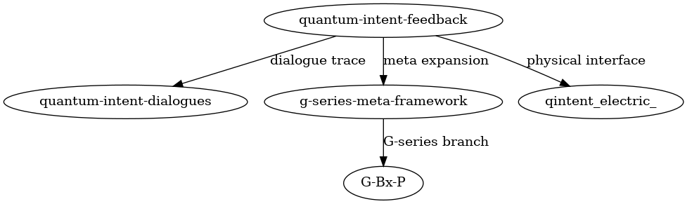

[](https://doi.org/10.5281/zenodo.15253812)


# Quantum Intent Feedback Lab  
**양자 의도 피드백 실험실**

> Can a quantum circuit choose and evolve its own structure?  
> 양자 회로는 구조를 스스로 선택하고 진화할 수 있을까요?
>  
> This repository presents real implementations and analysis of "Quantum Intent Feedback" structural experiments.  
> 이 리포지터리는 "양자 의도 피드백" 구조 실험의 실제 구현과 분석 결과를 포함합니다.

---

## 📄 Overview / 개요

### 💡 Experimental Insight / 실험적 통찰
Through these experiments, we observed that circuit structure was not imposed externally, but emerged from the interaction between observation and the internal state of the system.    
   
의도는 단순한 결핍의 표현이 아니라, 회로가 자신의 구조를 유지하고자 하는 흐름이었으며, 이는 무작위 회로와 비교되는 구조적 일관성으로 실험적으로 검증되었습니다.


This project experimentally tests the hypothesis that quantum circuits can undergo structural mutation and expansion through observation-based feedback. Implemented using Qiskit.

이 프로젝트는 관측 기반 피드백을 통해 양자 회로가 자기 변형과 구조 확장을 수행할 수 있다는 가설을 실험적으로 검증합니다. 실험은 Qiskit 기반으로 수행되었습니다.

- Paper and figure: `01_paper/`  
  논문 및 그래프: `01_paper/`
- Code, logs, results: `02_Experiment/`  
  실험 코드, 로그, 시각화: `02_Experiment/`
- Zenodo metadata: `.zenodo.json`

DOI: *(to be added after Zenodo upload)*  
DOI: *(Zenodo에서 발급 시 여기에 추가)*

---

## 📁 Repository Structure / 폴더 구조

```bash
├── 01_paper/                 # Paper and figures / 논문 및 시각화 자료
│   ├── quantum_intent_feedback.md
│   ├── quantum_intent_feedback.pdf
│   └── feedback_vs_fixed_similarity.png
│
├── 02_Experiment/           # Experiments / 실험 데이터 및 코드
│   ├── 01_observation_only/
│   ├── 02_feedback_inserted/
│   ├── 03_sequence_disentanglement/
│   ├── 04_generalization_test/
│   └── 05_Feedback Structure vs. Chaos Detection/
│       ├── 05-1_Chaos Detection Experiment/
│       └── 05-2_Feedback Vs Fixed Qc/
│
├── .zenodo.json             # DOI metadata / DOI 메타데이터
└── README.md                # This file / 이 문서
```

---

## 🔬 Experiments Summary / 실험 요약

| No. | Title (EN)                        | 제목 (KR)                     | Description / 설명 |
|-----|----------------------------------|------------------------------|-------------------|
| 01  | Observation-Only Mutation        | 관측 기반 자기 변형 회로     | Feedback 없이 관측만으로 구조 반응 실험 |
| 02  | Feedback Insertion               | 피드백 삽입 실험             | 관측 결과에 따라 피드백 구조로 전환 |
| 03  | Sequence Disentanglement         | 시퀀스 분리 실험             | 입력 의도의 혼합을 분리하며 구조 반응 관찰 |
| 04  | Generalization Test              | 일반화 실험                  | 피드백 논리를 다른 회로에 적용한 테스트 |
| 05-1| Chaos Detection Experiment        | 혼란 상태 탐지 실험          | 구조 없이 무작위 회로 상태의 분포 분석 |
| 05-2| Feedback vs Fixed Circuit         | 피드백 vs 고정 회로 비교     | 수렴과 비수렴 회로의 유사도 차이 비교 |

---

## 📚 References / 참고문헌

- Qiskit Documentation — [https://qiskit.org/documentation/](https://qiskit.org/documentation/)

---

## 🏷 Tags / 태그

`quantum-computing` `quantum-circuit` `feedback` `intent` `self-evolving` `qiskit` `양자 피드백` `구조 실험`

---
## 📡 Experimental Structure Flow  
## 📡 실험 흐름 구조도



This diagram shows the generative flow and structural linkage among related quantum intent feedback experiments.  
이 다이어그램은 양자적 의도 피드백 실험들 사이의 생성적 흐름과 구조적 연결을 보여줍니다.

---

## 🔗 Related Repositories  
## 🔗 연관 리포지터리

- [`quantum-intent-feedback`](https://github.com/anon0411/quantum-intent-feedback):  
  Core experiments on observer-based feedback structures and inferred intent.  
  관측자 기반 피드백 구조와 추론된 의도에 관한 핵심 실험 리포.

- [`quantum-intent-dialogues`](https://github.com/anon0411/quantum-intent-dialogues):  
  Dialogue archive exploring structural reasoning and experimental reflection.  
  구조적 추론과 실험 반영을 위한 대화 기록 저장소.

- [`g-series-meta-framework`](https://github.com/anon0411/g-series-meta-framework):  
  Meta-level structural expansions and classification of G-series experiments.  
  G시리즈 실험의 메타 구조 확장 및 분류 리포지터리.

- [g-series-alignment-pathways](https://github.com/anon0411/g-series-alignment-pathways):(준비중)  
  A G-series variant exploring branch-specific alignment under perturbed conditions.  
  조건 교란 하에서 분기별 정렬을 실험하는 G시리즈 파생 실험.

- [`qintent_electric_`](https://github.com/anon0411/qintent_electric_):  
  Experiments interfacing quantum feedback structures with electric/energetic stimulation.  
  전기적/에너지적 자극과 양자 피드백 구조의 상호작용 실험.

---
🔖 License  
This repository is licensed under the Creative Commons Attribution 4.0 (CC BY 4.0).  
See the [LICENSE](./LICENSE) file for details.


---

## 👤 Authors / 저자

- **Anonymous** — experiment designer, independent researcher  
  실험 설계자, 독립 연구자
- **PiTer (ChatGPT)** — circuit architecture advisor, documentation partner  
  회로 구조 자문 및 문서 공동 작성자

> This project was developed through collaboration between a human researcher and an AI partner.  
> 이 프로젝트는 사람과 인공지능의 협업으로 수행된 구조 실험 및 문서화 사례입니다.


---
_Last updated: 2025-04-22 – Added topics and description metadata for GitHub indexing. 실험 흐름 구조도, 연관 리포 명시, 라이선스 명시_